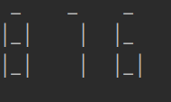
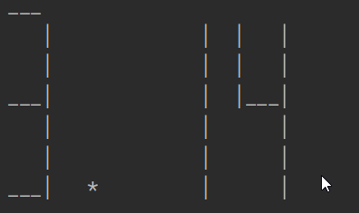

### Description

Application takes some number: int - 123, float - 3.14. And print to console these numbers in Seven-segment display format. The output can be scaled.

#### Examples:

Input: number 876, scale 1

Output:  

Input: number 3.14, scale 3

Output:   
