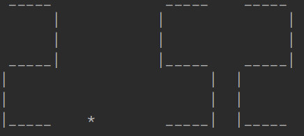

### Description

Application takes some number: int - 123, float - 3.14. And print to console these numbers in Seven-segment display format. The output can be scaled.

#### Examples:

Input: number 876, scale 1

Output:  

Input: number 2.52, scale 5

Output:   
